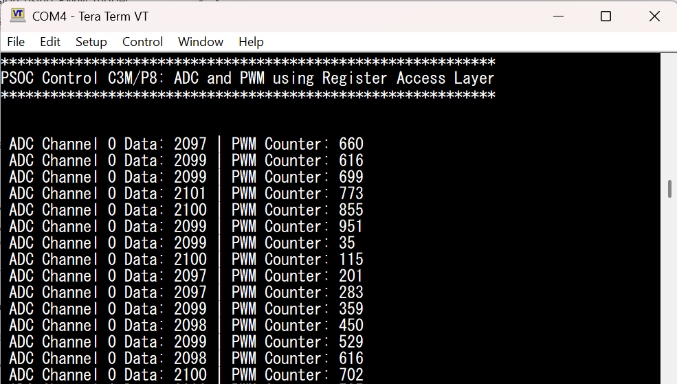

# PSOC&trade; Control C3M/P8: ADC and PWM using Register Access Layer

This code example applies for PSOC&trade; Control C3M/P8 MCUs. It demonstrates how to drive the **ADC and the PWM entirely through a thin, vendor-neutral Register Access Layer (RAL)**, while all platform/infrastructure bring-up (UART, BSP, system init, clocks, pins, interrupts) continues to use the standard ModusToolbox&trade; PDL and Device Configurator generated code.

The intent is to give customers who maintain a hardware-independent software ecosystem a single, well-defined place (the RAL) to port ADC/PWM functionality across MCU vendors, without touching the application logic and without re-writing the standard platform setup.

- The ADC is brought up (subsystem, analog reference, channel, trigger mode) and read through [ral/adc_ral.h](ral/adc_ral.h) / [ral/adc_ral.c](ral/adc_ral.c).
- The PWM is configured (period, compare, mode, trigger output) and operated (start, stop, live counter read) through [ral/pwm_ral.h](ral/pwm_ral.h) / [ral/pwm_ral.c](ral/pwm_ral.c).
- Both wrappers access hardware **only** through the device register-map headers. The functional configuration of the ADC and PWM is done entirely by the RAL - the Device Configurator is not used to *configure* the ADC or PWM peripherals.
- **The ADC is started by the PWM terminal-count (TC) event (hardware trigger).** The PWM RAL emits the TC on the counter's trigger output; the PWM-to-ADC trigger *connection* is established in the Device Configurator (which computes the device-specific trigger routing), and the application enables that route. See [Design and implementation](#design-and-implementation).

To support another MCU vendor, only `adc_ral.c` and `pwm_ral.c` have to be re-implemented for that vendor's register map - the application code and the platform setup stay unchanged.

## Architecture overview

```
        Application (main.c on each core)
                 |                 |
          ADC RAL API        PWM RAL API          <-- vendor-neutral wrappers (ral/)
       (adc_ral_*)          (pwm_ral_*)
                 |                 |
        Device Register Access Layer (Ifx SFR headers, mtb_shared)   <-- registers only
   ------------------------------------------------------------------
        UART / BSP / SystemInit / Clocks / Pins / Interrupts
                 |
        PDL + Device Configurator generated code (cybsp_init, cycfg_*)
```

### Separation of responsibilities

| Component | Owned by | Where |
| :-------- | :------- | :---- |
| ADC (subsystem, AREF, channel, trigger mode, read) | **RAL (registers only)** | [ral/adc_ral.c](ral/adc_ral.c) |
| PWM (period, compare, mode, trigger output, start/stop) | **RAL (registers only)** | [ral/pwm_ral.c](ral/pwm_ral.c) |
| PWM-to-ADC trigger route (EPU) | Device Configurator (device-specific routing) - enabled by the app | design.modus / `main.c` |
| UART (debug console) | PDL + Device Configurator | `cybsp_init()` / retarget-io |
| BSP init, `Cy_System_Init_CPU0()` | PDL | `cybsp.c` / `main.c` |
| Clocks, pins, interrupts, power, memory | PDL + Device Configurator | generated `cycfg_*` |
| PPCA subsystem controller (boots CPU0) | PDL + Device Configurator | `PPCA_CNFG` (system, not ADC/PWM) |

> **Note:** Because the ADC is configured purely from registers, the factory-calibration trims that the PDL/Device Configurator normally applies are **not** loaded. The values reported by this example are therefore raw, uncalibrated ADC counts.
>
> **Note:** The ADC and PWM are not *functionally configured* in the Device Configurator - their `init` is disabled, so `init_cycfg_peripherals()` contains no `Cy_PPCA_ADC_Init`, `Cy_PPCA_AREF_Init` or PWM init; the RAL owns all of that. The Device Configurator only assigns the debug-UART clock, initializes the PPCA subsystem controller (`Cy_PPCA_CNFG_Init`), enables the PWM peripheral-group clock, and sets up the PWM-to-ADC hardware trigger route (EPU). See [Device Configurator requirements](#device-configurator-requirements) and [Code regeneration process](#code-regeneration-process).

[View this README on GitHub.](https://github.com/Infineon/mtb-example-ce243289-adc-conv-using-register-layer)

[Provide feedback on this code example.](https://yourvoice.infineon.com/jfe/form/SV_1NTns53sK2yiljn?Q_EED=eyJVbmlxdWUgRG9jIElkIjoiQ0UyNDMyODkiLCJTcGVjIE51bWJlciI6IjAwMi00MzI4OSIsIkRvYyBUaXRsZSI6IlBTT0MmdHJhZGU7IENvbnRyb2wgQzNNL1A4OiBBREMgYW5kIFBXTSB1c2luZyBSZWdpc3RlciBBY2Nlc3MgTGF5ZXIiLCJyaWQiOiJkZWVwYWsuc2hhcm1hQGluZmluZW9uLmNvbSIsIkRvYyB2ZXJzaW9uIjoiMS4wLjAiLCJEb2MgTGFuZ3VhZ2UiOiJFbmdsaXNoIiwiRG9jIERpdmlzaW9uIjoiTUNEIiwiRG9jIEJVIjoiSUNXIiwiRG9jIEZhbWlseSI6IlBTT0MifQ==)

## Requirements

- [ModusToolbox&trade;](https://www.infineon.com/modustoolbox) v3.9.0 or later (tested with v3.9.0)
- Board support package (BSP) minimum required version for:
   - KIT_PSC3M8_EVK: v2.2.0
- Programming language: C
- Associated parts: All [PSOC&trade; Control C3M/P8 MCU](https://www.infineon.com/products/microcontroller/32-bit-psoc-arm-cortex/32-bit-psoc-control-arm-cortex-m33-mcu/psoc-control-c3-performance-line) parts


## Supported toolchains (make variable 'TOOLCHAIN')

- GNU Arm&reg; Embedded Compiler v14.2.1 (`GCC_ARM`) – Default value of `TOOLCHAIN`
- Arm&reg; Compiler v6.22 (`ARM`)
- IAR C/C++ Compiler v9.70.4 (`IAR`)


## Supported kits (make variable 'TARGET')

- [PSOC&trade; Control C3M8 Evaluation Kit](https://www.infineon.com/KIT_PSC3M8_EVK) (`KIT_PSC3M8_EVK`) – Default value of `TARGET`

## Hardware setup

The code example is for PSOC&trade; Control C3M/P8 evaluation board (`KIT_PSC3M8_EVK`).


## Software setup

See the [ModusToolbox&trade; tools package installation guide](https://www.infineon.com/ModusToolboxInstallguide) for information about installing and configuring the tools package.

Install a terminal emulator if you do not have one. Instructions in this document use [Tera Term](https://teratermproject.github.io/index-en.html).

This example requires no additional software or tools.


## Using the code example


### Create the project

The ModusToolbox&trade; tools package provides the Project Creator as both a GUI tool and a command line tool.

<details><summary><b>Use Project Creator GUI</b></summary>

1. Open the Project Creator GUI tool

   There are several ways to do this, including launching it from the dashboard or from inside the Eclipse IDE. For more details, see the [Project Creator user guide](https://www.infineon.com/ModusToolboxProjectCreator) (locally available at *{ModusToolbox&trade; install directory}/tools_{version}/project-creator/docs/project-creator.pdf*)

2. On the **Choose Board Support Package (BSP)** page, select a kit supported by this code example. See [Supported kits](#supported-kits-make-variable-target)

   > **Note:** To use this code example for a kit not listed here, you may need to update the source files. If the kit does not have the required resources, the application may not work

3. On the **Select Application** page:

   a. Select the **Applications(s) Root Path** and the **Target IDE**

      > **Note:** Depending on how you open the Project Creator tool, these fields may be pre-selected for you

   b. Select this code example from the list by enabling its check box

      > **Note:** You can narrow the list of displayed examples by typing in the filter box

   c. (Optional) Change the suggested **New Application Name** and **New BSP Name**

   d. Click **Create** to complete the application creation process

</details>


<details><summary><b>Use Project Creator CLI</b></summary>

The 'project-creator-cli' tool can be used to create applications from a CLI terminal or from within batch files or shell scripts. This tool is available in the *{ModusToolbox&trade; install directory}/tools_{version}/project-creator/* directory.

Use a CLI terminal to invoke the 'project-creator-cli' tool. On Windows, use the command-line 'modus-shell' program provided in the ModusToolbox&trade; installation instead of a standard Windows command-line application. This shell provides access to all ModusToolbox&trade; tools. You can access it by typing "modus-shell" in the search box in the Windows menu. In Linux and macOS, you can use any terminal application.

The following example clones the "[mtb-example-ce243289-adc-conv-using-register-layer](https://github.com/Infineon/mtb-example-ce243289-adc-conv-using-register-layer)" application with the desired name "AdcPwmRal" configured for the *KIT_PSC3M8_EVK* BSP into the specified working directory, *C:/mtb_projects*:

   ```
   project-creator-cli --board-id KIT_PSC3M8_EVK --app-id mtb-example-ce243289-adc-conv-using-register-layer --user-app-name AdcPwmRal --target-dir "C:/mtb_projects"
   ```

The 'project-creator-cli' tool has the following arguments:

Argument | Description | Required/optional
---------|-------------|-----------
`--board-id` | Defined in the <id> field of the [BSP](https://github.com/Infineon?q=bsp-manifest&type=&language=&sort=) manifest | Required
`--app-id`   | Defined in the <id> field of the [CE](https://github.com/Infineon?q=ce-manifest&type=&language=&sort=) manifest | Required
`--target-dir`| Specify the directory in which the application is to be created if you prefer not to use the default current working directory | Optional
`--user-app-name`| Specify the name of the application if you prefer to have a name other than the example's default name | Optional

<br>

> **Note:** The project-creator-cli tool uses the `git clone` and `make getlibs` commands to fetch the repository and import the required libraries. For details, see the "Project creator tools" section of the [ModusToolbox&trade; tools package user guide](https://www.infineon.com/ModusToolboxUserGuide) (locally available at {ModusToolbox&trade; install directory}/docs_{version}/mtb_user_guide.pdf).

</details>


### Open the project

After the project has been created, you can open it in your preferred development environment.


<details><summary><b>Eclipse IDE</b></summary>

If you opened the Project Creator tool from the included Eclipse IDE, the project will open in Eclipse automatically.

For more details, see the [Eclipse IDE for ModusToolbox&trade; user guide](https://www.infineon.com/MTBEclipseIDEUserGuide) (locally available at *{ModusToolbox&trade; install directory}/docs_{version}/mt_ide_user_guide.pdf*).

</details>


<details><summary><b>Visual Studio (VS) Code</b></summary>

Launch VS Code manually, and then open the generated *{project-name}.code-workspace* file located in the project directory.

For more details, see the [Visual Studio Code for ModusToolbox&trade; user guide](https://www.infineon.com/MTBVSCodeUserGuide) (locally available at *{ModusToolbox&trade; install directory}/docs_{version}/mt_vscode_user_guide.pdf*).

</details>


<details><summary><b>Command line</b></summary>

If you prefer to use the CLI, open the appropriate terminal, and navigate to the project directory. On Windows, use the command-line 'modus-shell' program; on Linux and macOS, you can use any terminal application. From there, you can run various `make` commands.

For more details, see the [ModusToolbox&trade; tools package user guide](https://www.infineon.com/ModusToolboxUserGuide) (locally available at *{ModusToolbox&trade; install directory}/docs_{version}/mtb_user_guide.pdf*).

</details>


## Operation

1. Connect the board to your PC using the provided USB cable through the KitProg3 USB connector

2. Open a terminal program and select the KitProg3 COM port. Set the serial port parameters to 8N1 and 115200 baud

3. Program the board using one of the following:

   <details><summary><b>Using Eclipse IDE</b></summary>

      1. Select the application project in the Project Explorer

      2. In the **Quick Panel**, scroll down, and click **\<Application Name> Program (KitProg3_MiniProg4)**
   </details>


   <details><summary><b>In other IDEs</b></summary>

   Follow the instructions in your preferred IDE.

   </details>


   <details><summary><b>Using CLI</b></summary>

     From the terminal, execute the `make program` command to build and program the application using the default toolchain to the default target. The default toolchain is specified in the application's Makefile but you can override this value manually:
      ```
      make program TOOLCHAIN=<toolchain>
      ```

      Example:
      ```
      make program TOOLCHAIN=GCC_ARM
      ```
   </details>

4. After programming, the application starts automatically. Confirm that the "ADC conversion using Register Access Layer" banner is displayed on the UART terminal

   **Figure 1. Terminal output on program startup**

   

5. The main core configures the ADC and PWM through the RAL and enables the PWM-to-ADC trigger route; each PWM period (terminal count) then starts one ADC group 0 / channel 0 conversion. The PPCA core reads each result through the ADC Register Access Layer and shares it with the main core

6. Monitor the UART terminal to see the converted ADC channel 0 data (raw, uncalibrated counts) and the live PWM counter value printed each time a new conversion completes


## Debugging

You can debug the example to step through the code.


<details><summary><b>In Eclipse IDE</b></summary>

Use the **\<Application Name> Debug (KitProg3_MiniProg4)** configuration in the **Quick Panel**. For details, see the "Program and debug" section in the [Eclipse IDE for ModusToolbox&trade; user guide](https://www.infineon.com/MTBEclipseIDEUserGuide).

</details>


<details><summary><b>In other IDEs</b></summary>

Follow the instructions in your preferred IDE.

</details>


## Design and implementation

### Multicore architecture

This application demonstrates inter-core communication using shared memory together with a register-only ADC and PWM bring-up:

1. **Main CM33 Secure Core**:
   - Brings up the analog subsystem, AREF and ADC group 0 (hardware-trigger mode) entirely through the ADC Register Access Layer
   - Configures a PWM (PPCA TCPWM0, group 0, counter 0) through the PWM Register Access Layer and makes it emit its terminal-count event on the trigger output
   - Enables the PWM-to-ADC trigger route (set up by the device configuration) and starts the PWM
   - Boots PPCA Core 0 from flash memory
   - Monitors the shared-memory status flag written by PPCA Core 0
   - Prints the converted ADC channel 0 data and the live PWM counter via UART

2. **PPCA Core 0**:
   - Reads the latest ADC group 0 / channel 0 result (started by the PWM terminal count) through the Register Access Layer and writes it to shared memory
   - Sets a status flag to notify the main core that new data is available

3. **PPCA Core 1**:
   - Idle in this example

### Trigger path (PWM terminal count → ADC)

The ADC is started in hardware by the PWM, with no CPU action per conversion:

1. The PWM RAL selects the terminal-count (TC / period) event as the PWM counter's trigger output (`pwm_ral_init` sets `TR_OUT_SEL`).
2. The Device Configurator routes that trigger output through the Event Processing Unit (EPU) to the ADC group 0 start-of-conversion (SOC) input. It computes the device-specific EPU source/destination indices, and the generated `init_cycfg_peripherals()` configures the EPU processing unit and combiner for this route.
3. The generated route is left disabled, so the application activates it once (`Cy_PPCA_EPU_Enable` + `Cy_PPCA_EPU_PU_T1_Enable` in [main_cm33_s/main.c](main_cm33_s/main.c)).
4. The ADC RAL puts the ADC in hardware-trigger mode (`adc_ral_init(..., ADC_RAL_TRIGGER_HARDWARE)`), so each SOC pulse from the PWM starts one conversion.

Result: every PWM period produces one ADC conversion; PPCA Core 0 simply reads and shares the latest result.

### Communication mechanism

- **Shared Memory Addresses**:
  - PPCA Core 0 writes the ADC result at `0x20000400` and a status flag at `0x20000404` (PPCA view)
  - The main core reads the same locations through its PPCA memory window at `0x53020400` / `0x53020404`

- **Polling Strategy**: The main core polls the status flag and prints the new ADC value whenever a conversion completes

### Resources and settings


The application uses the UART to print messages on the UART terminal. The UART resource initialization and retargeting of standard I/O to the UART port is performed using the [retarget-io](https://github.com/Infineon/retarget-io) library.

**Table 1. Application resources**

Resource  |  Alias/object     |    Purpose
:-------- | :-------------    | :------------
 UART (PDL/HAL) | UART / DEBUG_UART_hal_obj | Debug console. Configured by the Device Configurator and used by Retarget-IO. **Stays PDL/Device Configurator managed.**
 ADC (RAL)  | ADC group 0 / channel 0 | Single-channel ADC in hardware-trigger mode, started by the PWM terminal count; brought up and read entirely through the Register Access Layer ([ral/adc_ral.c](ral/adc_ral.c))
 PWM (RAL)  | PPCA TCPWM0 / group 0 / counter 0 | Edge-aligned PWM, configured and started entirely through the Register Access Layer; its terminal count triggers the ADC ([ral/pwm_ral.c](ral/pwm_ral.c))


<br>


### ADC and PWM RAL usage examples

Both RAL APIs are MCU-vendor independent; the application never touches a hardware register directly.

**ADC (from [main_cm33_s/main.c](main_cm33_s/main.c) and [ppca_cm33_0/main.c](ppca_cm33_0/main.c))**

```c
#include "adc_ral.h"

/* One-time bring-up (main secure core) */
adc_ral_subsystem_enable();              /* power/clock the PPCA analog subsystem */
adc_ral_reference_enable();              /* on-chip analog voltage reference (AREF) */
adc_ral_init(ADC_RAL_GROUP_0, 0U, ADC_RAL_TRIGGER_HARDWARE); /* group 0, ch 0, hardware-triggered */
adc_ral_enable(ADC_RAL_GROUP_0);

/* Each conversion is started by the PWM terminal count (hardware trigger), so the
 * PPCA core just reads the latest result - no software trigger is issued. */
uint16_t sample = adc_ral_read(ADC_RAL_GROUP_0, 0U);      /* read raw result */

/* For software-triggered use instead, pass ADC_RAL_TRIGGER_SOFTWARE to adc_ral_init()
 * and start each conversion explicitly:
 *   adc_ral_trigger(ADC_RAL_GROUP_0, (uint16_t)(1U << 0U));
 *   while (adc_ral_is_busy(ADC_RAL_GROUP_0)) { }
 */
```

**PWM (from [main_cm33_s/main.c](main_cm33_s/main.c))**

```c
#include "pwm_ral.h"

pwm_ral_subsystem_enable();                          /* idempotent; same PPCA subsystem as the ADC */
pwm_ral_init(PWM_RAL_INSTANCE_0, 999U, 500U);        /* period = 1000 counts, 50% duty; TC on trigger output */
pwm_ral_start(PWM_RAL_INSTANCE_0);                   /* software start trigger */

pwm_ral_set_compare(PWM_RAL_INSTANCE_0, 250U);       /* change duty at run time (25%) */
uint32_t count = pwm_ral_get_counter(PWM_RAL_INSTANCE_0);  /* live counter (proves it runs) */
pwm_ral_stop(PWM_RAL_INSTANCE_0);                    /* software stop trigger */
```

The RAL sources are added to the build through each project's *Makefile* (`SOURCES=../ral/adc_ral.c ../ral/pwm_ral.c`, `INCLUDES=../ral`).


### Device Configurator requirements

The Device Configurator (*.modus*) owns the platform and the PWM-to-ADC trigger *route*, but **not** the ADC/PWM functional configuration:

- **UART** - keep enabled and configured (SCB2, debug console). Its clock assignment is generated into `init_cycfg_peripherals()`.
- **System / BSP / clocks / pins / interrupts / power / memory** - keep generated by the Device Configurator and PDL.
- **PPCA subsystem controller (`PPCA_CNFG`)** - kept. System infrastructure (boots CPU0, allocates the subsystem); not ADC/PWM configuration.
- **ADC / AREF / PWM blocks** - present in the configuration **only as trigger-route endpoints**, with their `init` set to **false**. This exposes their trigger ports (PWM `tr_out`, ADC `adc_soc`) for routing but generates **no** `Cy_PPCA_ADC_Init`, `Cy_PPCA_AREF_Init`, or PWM init - the RAL performs all ADC/PWM configuration at run time.
- **PWM-to-ADC trigger route (EPU)** - one EPU processing unit (`START_TRIG`) and one combiner (`ADC0_START_TRIG`, index 60), plus three nets, wire the PWM `tr_out` to the ADC `adc_soc`. The Device Configurator computes the device-specific EPU indices.

After regeneration, the generated `init_cycfg_peripherals()` contains only:

```c
Cy_SysClk_PeriPclkAssignDivider(PCLK_SCB2_CLOCK_SCB_EN, CY_SYSCLK_DIV_8_BIT, 0U);  /* UART clock */
Cy_PPCA_CNFG_Init(PPCA_CNFG_HW, &PPCA_CNFG_config);                                /* subsystem  */
Cy_PPCA_EPU_Combo_Configure(ADC0_START_TRIG_HW, ADC0_START_TRIG_INDEX, ...);       /* route      */
Cy_PPCA_EPU_PU_T1_Configure(START_TRIG_HW, START_TRIG_INDEX, ...);                 /* route      */
Cy_SysClk_PeriGroupSlaveInit(CY_MMIO_TCPWM0_...);                                  /* PWM clock  */
```

There is **no** `Cy_PPCA_ADC_Init`, `Cy_PPCA_AREF_Init`, or PWM functional init - the RAL owns those. Because `Cy_PPCA_EPU_PU_T1_Configure` leaves the processing unit disabled, the application enables the route once at start-up (see [Trigger path](#trigger-path-pwm-terminal-count--adc)).


### Code regeneration process

Regenerating the configuration is safe - it does **not** reintroduce any ADC/PWM dependency:

1. Open the Device Configurator on the BSP (*Quick Panel -> Device Configurator*, or `make config`), or simply run a build - the build automatically invokes `device-configurator-cli` when *design.modus* is newer than the generated sources.
2. The tool regenerates *bsps/TARGET_APP_KIT_PSC3M8_EVK/config/GeneratedSource/cycfg_\*.c/.h* from the trimmed *design.modus*.
3. Because the ADC/AREF/PWM blocks have `init = false`, the regenerated `cycfg_peripherals.c` keeps the UART clock, the PPCA subsystem init, the PWM group clock, and the EPU trigger route - but **no** ADC/PWM functional init (verified above).

> Keep `init = false` on the ADC, AREF and PWM blocks. If you re-enable their `init`, the Device Configurator will generate PDL initialization that competes with the RAL.


### Build and validation

Build the whole application (regenerates the configuration first, then compiles all three cores):

```
make build TOOLCHAIN=GCC_ARM
```

Expected result: all three projects (`main_cm33_s`, `ppca_cm33_0`, `ppca_cm33_1`) compile and link with no errors, and the merged programming files are produced under *build/project_hex/*. This example was validated with a clean `make build` (0 errors).

To program:

```
make program TOOLCHAIN=GCC_ARM
```


### Known assumptions and limitations

- **Uncalibrated ADC counts.** Because the ADC is configured purely from registers, the factory-calibration/gain trims normally applied by the PDL/Device Configurator are not loaded; the printed ADC values are raw counts.
- **PWM clocking.** The PWM's peripheral-group clock is enabled by the Device Configurator (the PWM block is present for the trigger route). Driving a physical PWM output pin additionally requires a pin/HSIOM route, which remains a Device Configurator (pins) responsibility and is out of the RAL's scope.
- **Trigger route is device-specific.** The PWM-to-ADC route uses the Event Processing Unit (EPU). The routing indices are computed by the Device Configurator, and the application enables the configured route at start-up. Porting to another device also requires an equivalent trigger route on that device.
- **Register map is device-specific.** [ral/adc_ral.c](ral/adc_ral.c) and [ral/pwm_ral.c](ral/pwm_ral.c) target the PSOC&trade; Control C3 register map. Porting to another device requires re-implementing only these two files; the RAL headers and the application stay unchanged.
- **RAL scope.** The RAL deliberately covers ADC and PWM only. UART, system init, clocks, pins, interrupts, and the trigger route stay on PDL + Device Configurator.
- **Template BSP.** The active configuration edited here is *bsps/TARGET_APP_KIT_PSC3M8_EVK/config/design.modus* (used by the build). If you re-create the project from the template, re-apply the same changes to *templates/.../config/design.modus*.


## Related resources

Resources  | Links
-----------|----------------------------------
Code examples  | [Using ModusToolbox&trade;](https://github.com/Infineon/Code-Examples-for-ModusToolbox-Software) on GitHub
Device documentation | [PSOC&trade; Control C3M/P8 MCU documents](https://www.infineon.com/products/microcontroller/32-bit-psoc-arm-cortex/32-bit-psoc-control-arm-cortex-m33-mcu/psoc-control-c3-performance-line?ftab=01#Documents)
Development kits | Select your kits from the [Evaluation board finder](https://www.infineon.com/cms/en/design-support/finder-selection-tools/product-finder/evaluation-board)
Libraries on GitHub  | [mtb-dsl-psc3m8](https://github.com/Infineon/mtb-dsl-psc3m8) – Device Support Library (DSL) <br> [retarget-io](https://github.com/Infineon/retarget-io) – Utility library to retarget STDIO messages to a UART port
Tools  | [ModusToolbox&trade;](https://www.infineon.com/modustoolbox) – ModusToolbox&trade; software is a collection of easy-to-use libraries and tools enabling rapid development with Infineon MCUs for applications ranging from wireless and cloud-connected systems, edge AI/ML, embedded sense and control, to wired USB connectivity using PSOC&trade; Industrial/IoT MCUs, AIROC&trade; Wi-Fi and Bluetooth&reg; connectivity devices, XMC&trade; Industrial MCUs, and EZ-USB&trade;/EZ-PD&trade; wired connectivity controllers. ModusToolbox&trade; incorporates a comprehensive set of BSPs, HAL, libraries, configuration tools, and provides support for industry-standard IDEs to fast-track your embedded application development

<br>


## Other resources

Infineon provides a wealth of data at [www.infineon.com](https://www.infineon.com) to help you select the right device, and quickly and effectively integrate it into your design.


## Document history

Document title: *CE243289* – *PSOC&trade; Control C3M/P8: ADC and PWM using Register Access Layer*

 Version | Description of change
 ------- | ---------------------
 1.0.0   | New code example
 <br>


All referenced product or service names and trademarks are the property of their respective owners.

The Bluetooth&reg; word mark and logos are registered trademarks owned by Bluetooth SIG, Inc., and any use of such marks by Infineon is under license.

PSOC&trade;, formerly known as PSoC&trade;, is a trademark of Infineon Technologies. Any references to PSoC&trade; in this document or others shall be deemed to refer to PSOC&trade;.

---------------------------------------------------------

(c) 2024-2026, Infineon Technologies AG, or an affiliate of Infineon Technologies AG. All rights reserved.
This software, associated documentation and materials ("Software") is owned by Infineon Technologies AG or one of its affiliates ("Infineon") and is protected by and subject to worldwide patent protection, worldwide copyright laws, and international treaty provisions. Therefore, you may use this Software only as provided in the license agreement accompanying the software package from which you obtained this Software. If no license agreement applies, then any use, reproduction, modification, translation, or compilation of this Software is prohibited without the express written permission of Infineon.
<br>
Disclaimer: UNLESS OTHERWISE EXPRESSLY AGREED WITH INFINEON, THIS SOFTWARE IS PROVIDED AS-IS, WITH NO WARRANTY OF ANY KIND, EXPRESS OR IMPLIED, INCLUDING, BUT NOT LIMITED TO, ALL WARRANTIES OF NON-INFRINGEMENT OF THIRD-PARTY RIGHTS AND IMPLIED WARRANTIES SUCH AS WARRANTIES OF FITNESS FOR A SPECIFIC USE/PURPOSE OR MERCHANTABILITY. Infineon reserves the right to make changes to the Software without notice. You are responsible for properly designing, programming, and testing the functionality and safety of your intended application of the Software, as well as complying with any legal requirements related to its use. Infineon does not guarantee that the Software will be free from intrusion, data theft or loss, or other breaches (“Security Breaches”), and Infineon shall have no liability arising out of any Security Breaches. Unless otherwise explicitly approved by Infineon, the Software may not be used in any application where a failure of the Product or any consequences of the use thereof can reasonably be expected to result in personal injury.
